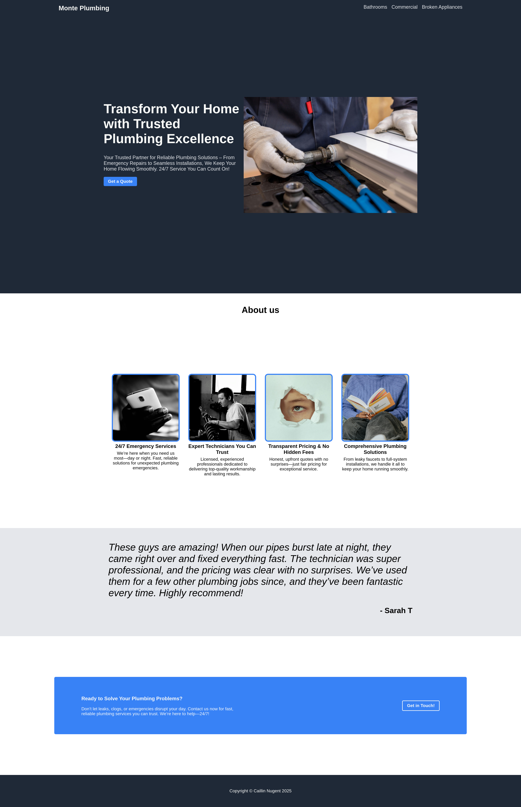

# odin-landing-page
Sample landing page made for an exercise in the Odin Project - for a hypothetical business called monte's plumbing

## How to view
Click on the deployment on the right of the screen or click this [link](https://nugentcaillin.github.io/odin-landing-page/)
## How to run
### Clone this repositiory
```console
$ git clone git@github.com:nugentcaillin/odin-landing-page.git
```
### Then, run index.html in your browser of choice eg. chrome
```console
$ cd odin-landing-page
$ google-chrome-stable index.html
```
## Code base
This is a static site made with pure HTML and CSS
## Screenshot

